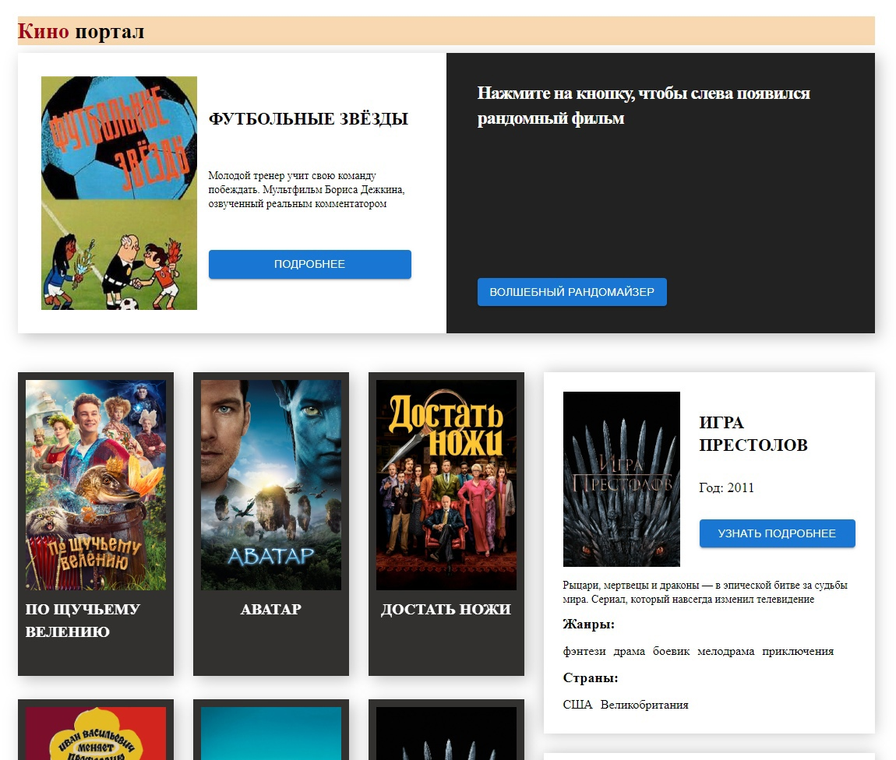
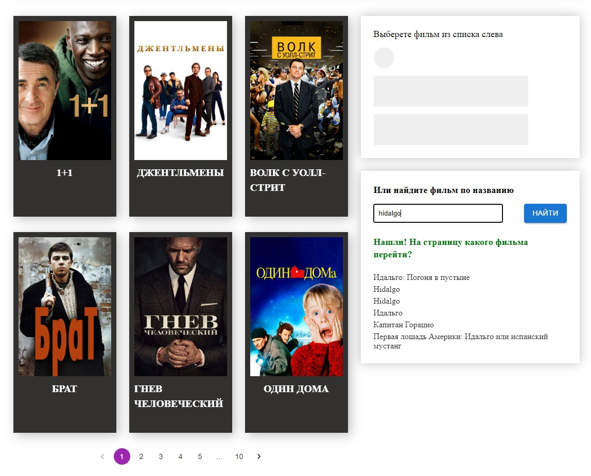
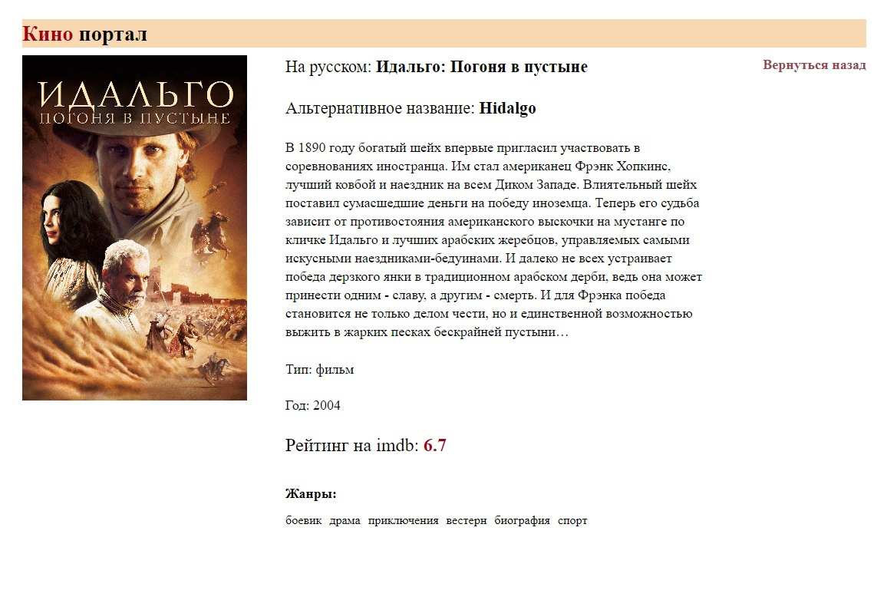

# React-Cinemaholic

## Стек технологий


## Главная страница





## Возможности:

- Загрузка рандомного фильма и его обновление по запросу

- На главной странице также есть пагинация с загрузкой новых фильмов на каждой странице

- Карточка каждого загруженного в списке фильма открывается/обновляется справа

- Кнопка "Узнать подробнее" является ссылкой на страницу фильма Films/id

- Справа также есть форма для поиска фильмов по названию: выведенный список фильмов является ссылками на страницы с более подробной информацией

## Установка

### Склонировать репозиторий

```sh
   git clone git@github.com:KovOlga/react-cinemaholic.git
```

### Установить зависимости

```sh
   npm install
```

### Запустить проект в режиме разработки

```sh
   npm run dev
```
